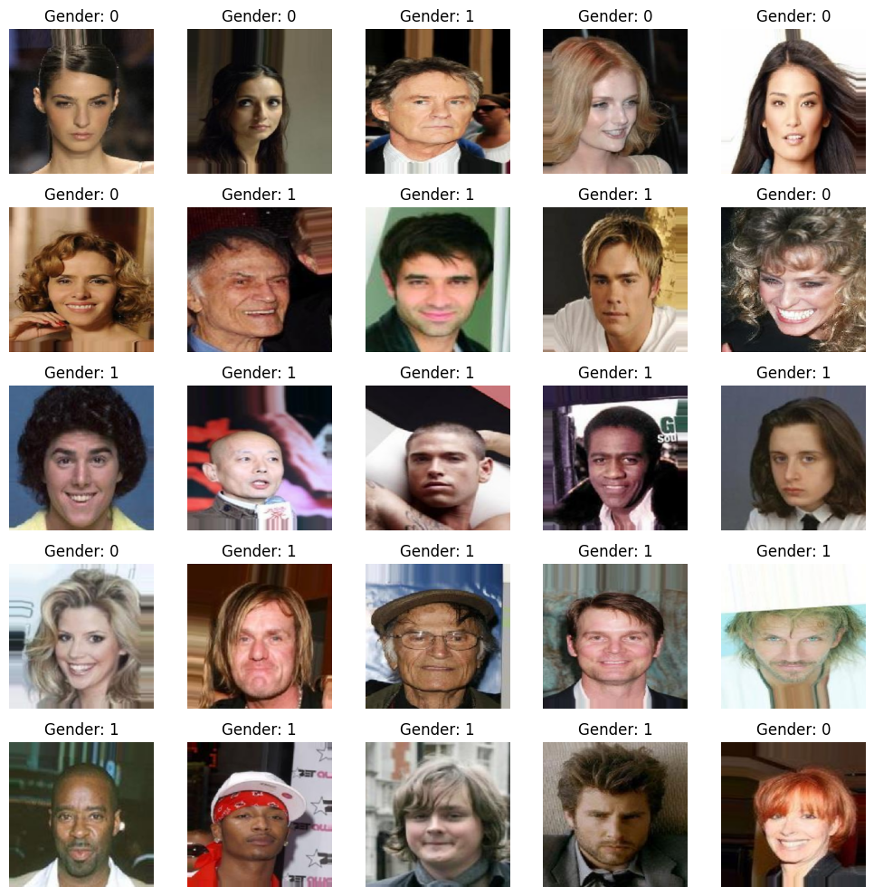
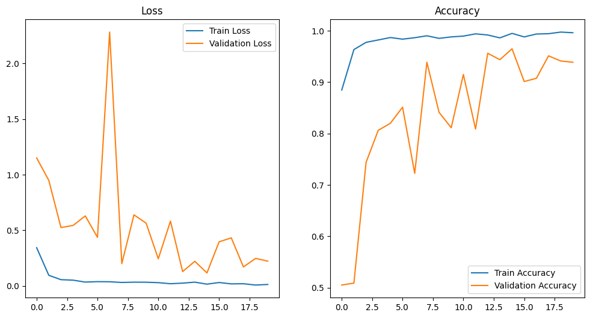
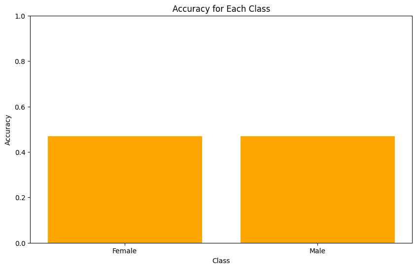
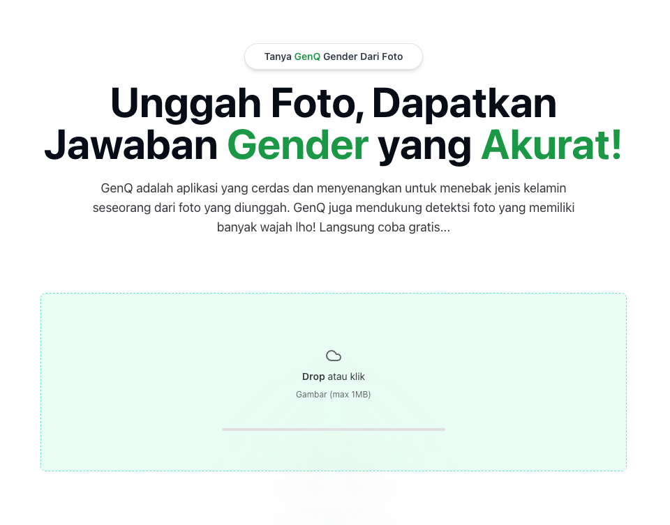
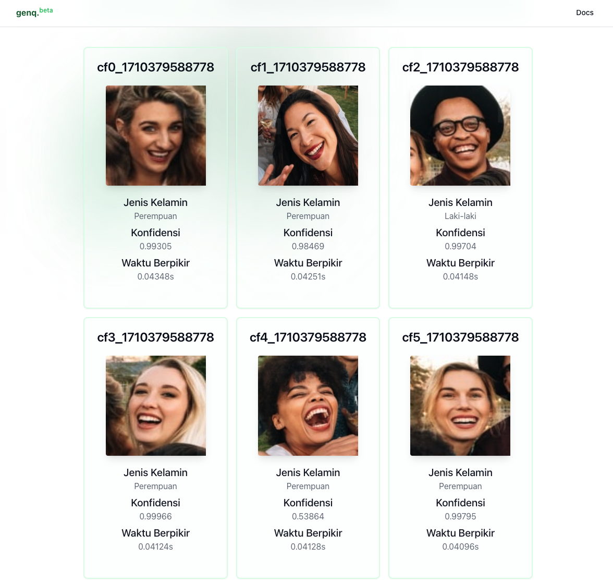
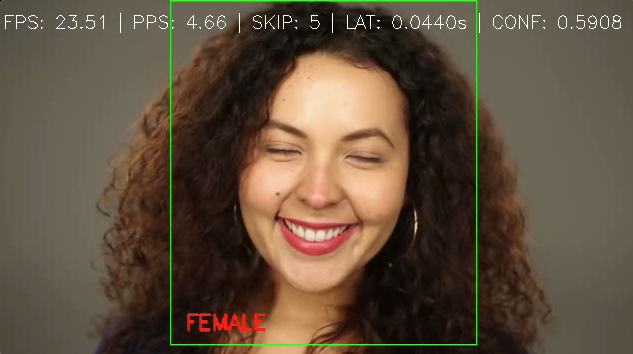

# Daftar Isi
- [Deskripsi Proyek](#deskripsi-proyek)
- [Dataset](#dataset)
- [Model GoogleNet InceptionV3](#model-googlenet-inceptionv3)
- [Evaluasi](#evaluasi)
- [Implementasi](#implementasi)

## Deskripsi Proyek
Proyek ini bertujuan mengembangkan model Klasifikasi Gender menggunakan arsitektur GoogleNet InceptionV3 untuk mengidentifikasi jenis kelamin dari wajah manusia dalam gambar. Model akan dilatih dengan dataset CelebA yang berisi gambar-gambar selebriti dengan label gender. Tujuan proyek ini adalah menciptakan model yang mampu memprediksi jenis kelamin seseorang dalam gambar dengan akurasi tinggi.

## Dataset
Dataset CelebA berisi lebih dari 200.000 gambar selebriti dengan anotasi untuk berbagai atribut, termasuk jenis kelamin. Untuk proyek ini, kita akan memilih subset sebanyak 5000 gambar dengan distribusi yang seimbang antara sampel laki-laki dan perempuan. Subset ini akan digunakan untuk pelatihan, validasi, dan pengujian model.

## Model GoogleNet InceptionV3
GoogleNet InceptionV3 adalah arsitektur jaringan saraf konvolusi (CNN) yang dikembangkan oleh Google untuk klasifikasi gambar. Dengan total 48 lapisan, InceptionV3 menggunakan modul Inception untuk mengekstrak fitur dari berbagai skala dan kompleksitas. Keunggulan utamanya adalah efisiensi komputasi dan akurasi tinggi, karena menggunakan teknik regulerisasi seperti augmentasi data, dropout, dan normalisasi batch.

## Evaluasi
Evaluasi model akan dilakukan menggunakan metrik akurasi (accuracy) terhadap dataset pengujian yang telah dipisahkan dari dataset pelatihan. Selain itu, akan dilakukan juga analisis terhadap metrik lain seperti precision, recall, dan F1-score untuk memahami kinerja model lebih lanjut.

## Implementasi
Model yang telah dilatih akan diimplementasikan dalam sebuah aplikasi web menggunakan FastAPI sebagai [backend](https://github.com/siapai/genq-api.git) dan Next.js sebagai [frontend](https://github.com/siapai/genq.git). Aplikasi ini akan memungkinkan pengguna untuk mengunggah gambar wajah dan melihat prediksi jenis kelamin dari gambar tersebut. Kami akan menambahkan fungsi untuk mendukung gambar dengan multiple faces (wajah-wajah dalam satu gambar) agar model dapat mengidentifikasi jenis kelamin setiap wajah secara terpisah.

- [Link github backend](https://github.com/siapai/genq-api.git)
- [Link github frontend](https://github.com/siapai/genq.git)
- [Download InceptionV3_Epoch_20_Gender.ONNX](https://drive.google.com/file/d/1lHFrJ0bXnThH41KsXoIlfdY9rwHSWync/view?usp=sharing)

## Implementasi Video

